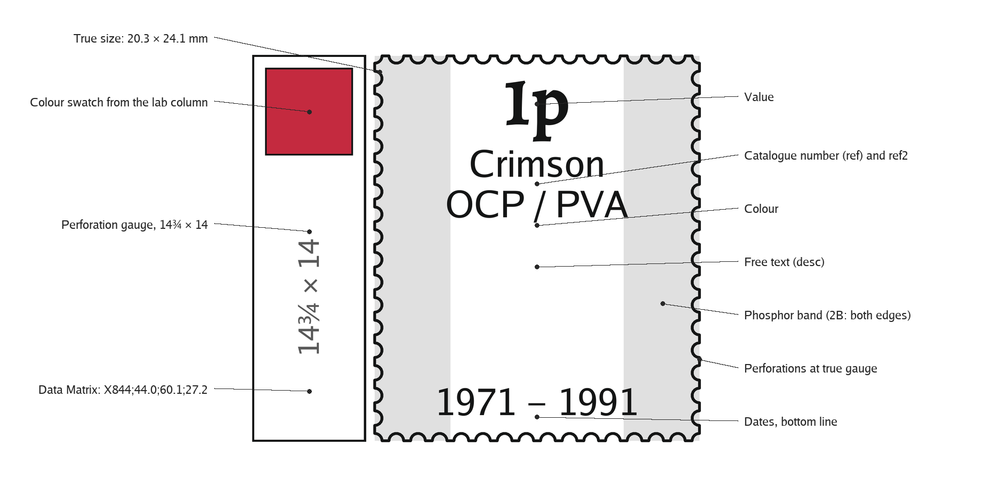
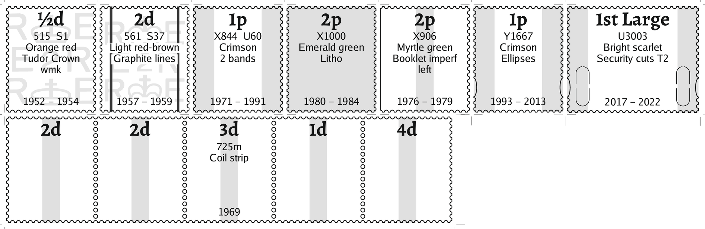
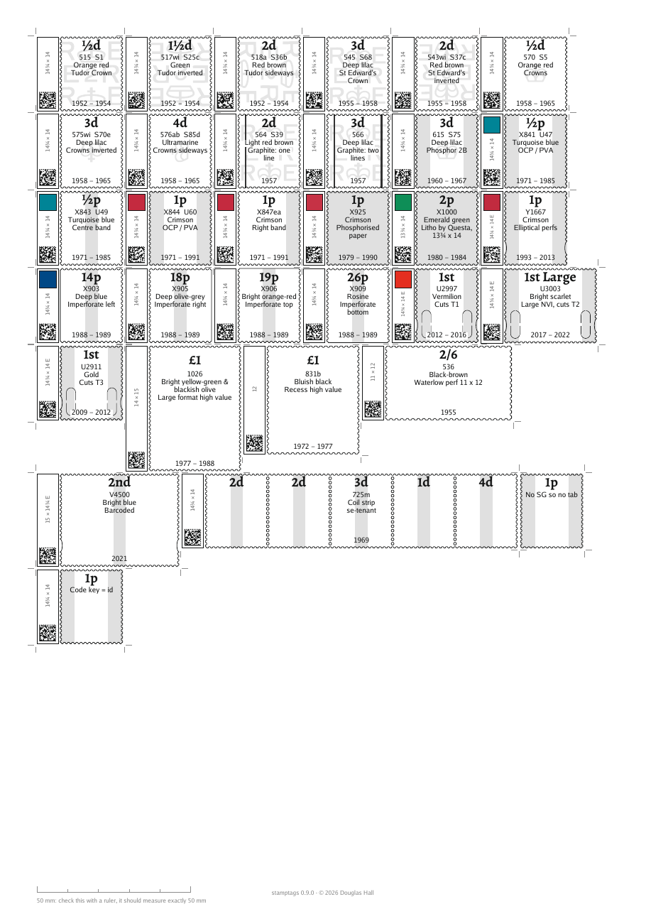

# stamptags

**stamptags generates custom identification tags for stamps, complete with accurately drawn perforations.**

Describe your collection in a CSV file: catalogue number, denomination, colour (or `color`), dates, perforation gauge, phosphor bands, watermark and any other information you want to record. stamptags generates a print-ready PDF containing one tag for each stamp.

Each tag is drawn at the actual dimensions of the stamp, including its perforations. Printed at 100%, they are designed to sit alongside the stamp in a stockbook or album, providing both an identification label and a visual reference.

The perforated outline is generated from the stamp's dimensions and perforation gauge rather than being merely decorative. Place the stamp over its tag and the perforations should align all the way around, providing a quick visual check of the perforation gauge.

An optional information strip can contain a colour swatch, perforation gauge and a Data Matrix code containing a catalogue reference or other identifier.

The contents and appearance of the tags are controlled from the CSV file, so the program can be used for anything from simple catalogue labels to detailed profiles for specialised collections.

This program was made and tested primarily for British definitives (Machins and Wildings), but it should work with any stamp whose dimensions and perforation gauge are known.

## How to use it
1. Make a list of your stamps in Excel, Numbers or Google Sheets, one row per stamp, with the stamptags column names, in the first row.
2. Save or export it as a CSV file.
3. Run stamptags on it to generate the PDF.
4. Print the PDF at 100%, with no scaling.

## Install
stamptags is a self-contained command-line program. There are no dependencies or additional packages to install. Run it from Terminal on macOS or Linux, or Command Prompt or PowerShell on Windows.
- **macOS** (11 or later, Apple Silicon and Intel): open the dmg and drag `stamptags` to a folder of your choice. macOS will open it without a security warning. If you put it in `/usr/local/bin` you can type `stamptags` from anywhere. Otherwise open a Terminal window in the folder it is in
  (right-click the folder in Finder → Services → New Terminal at Folder) and type `./stamptags`.
- **Windows** (10 or 11, 64-bit): unzip the package. `stamptags.exe` runs from wherever you put it, type
  `stamptags` in a Command Prompt opened in that folder.  
- **Linux** (x86-64): unzip the package, open a terminal in that directory and run `./stamptags`. 

Then try:
    stamptags --demo

This writes two files into the current folder:
- `demo.pdf` — examples showing the different kinds of tag stamptags can make,
  followed by the built-in help, CSV column reference, stamp formats and
  example data.
- `demo.csv` — the example CSV itself. Copy and edit this as the starting
  point for your own collection.

Full documentation, including the CSV columns, size codes and true-size printing instructions, is in `MANUAL.pdf`.
For a quick reference at the command line, use `stamptags --help`, `stamptags --list-columns` or `stamptags --list-formats`.

## Known issues
- **Some built-in stamp formats have not yet been precisely verified.**
Their dimensions were initially taken from published sources, but measurements against actual stamps have shown that some of these figures are not sufficiently precise for true-size tags and can be out by a few millimetres. The standard Wilding and Machin definitive formats have been measured accurately. The remaining formats will be checked against actual stamps and corrected in future releases.

## Downloads and feedback
The newest version for each operating system is always on the
[GitHub releases page](https://github.com/tacgnol/stamptags-releases/releases/latest).
If you find a bug, have a problem using stamptags, or have an idea for a new feature, please email me at [doug.hall@gmail.com](mailto:doug.hall@gmail.com). 
For bug reports, please include the version number, what went wrong, what you expected to happen and, if relevant, the row of your CSV that caused the problem. `stamptags --version` tells you which version you have.

## Copyright and licence
Copyright (c) 2026 Douglas Hall <doug.hall@gmail.com>.
stamptags is licensed under the **PolyForm Noncommercial License 1.0.0** (the full text is in `LICENSE.md`, or `LICENSE.pdf` in a release package). In short:
- **Personal, club, educational and other noncommercial use is free.** You may use it, copy it, pass it to other collectors, and print as many tags as you like. If you're a collector selling or exchanging some of your own stamps, you're welcome to use the tags with them.
- **Commercial use is not covered by this licence.** For example, stamp dealers, auction houses and other businesses may not use stamptags in the course of their business, and tags or other output from stamptags may not be produced for sale commercially. If you want to use stamptags commercially, contact me at [doug.hall@gmail.com](mailto:doug.hall@gmail.com) to arrange licensing terms.
- Keep this notice and the licence with any copy you pass on.

stamptags includes Luxi Sans, Luxi Mono and Alegreya; their respective licences permit their redistribution with the program.
